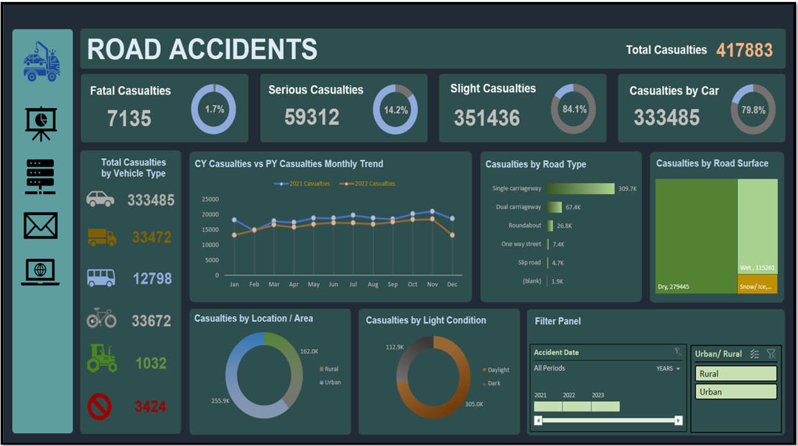
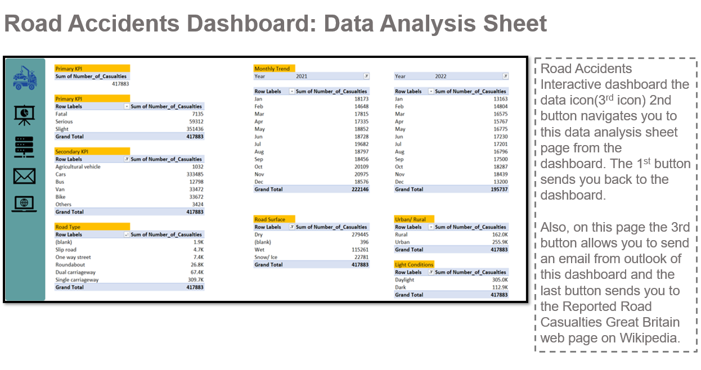
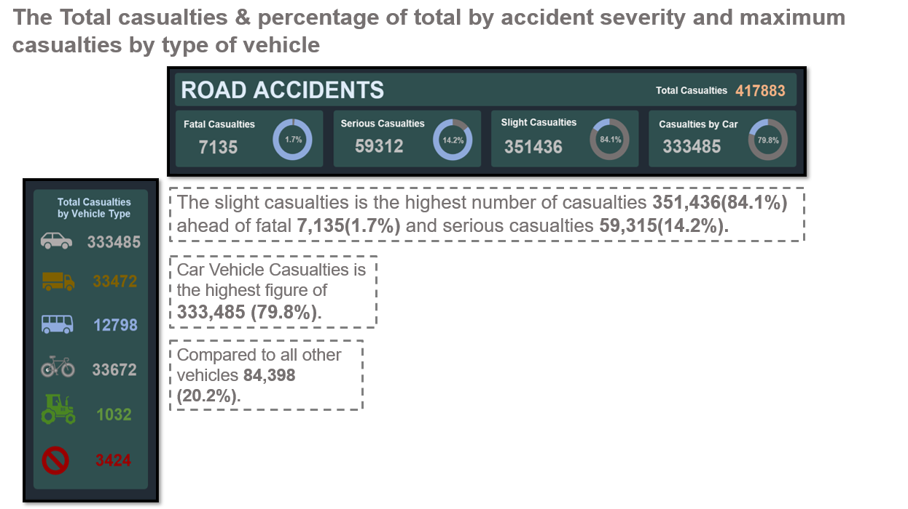
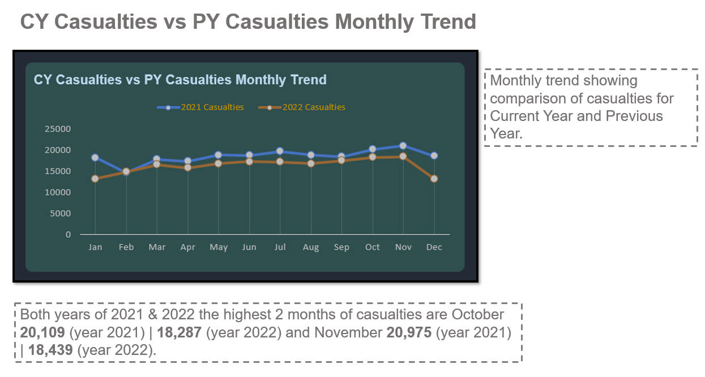
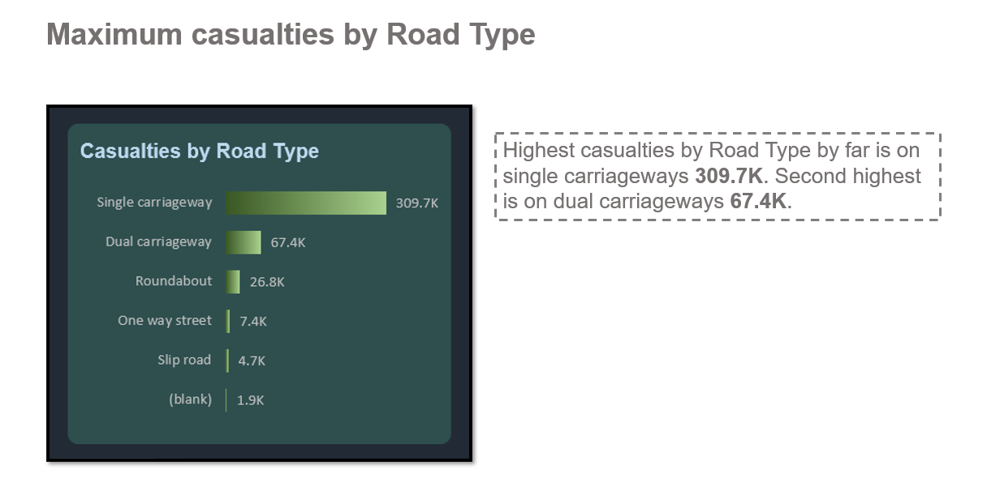
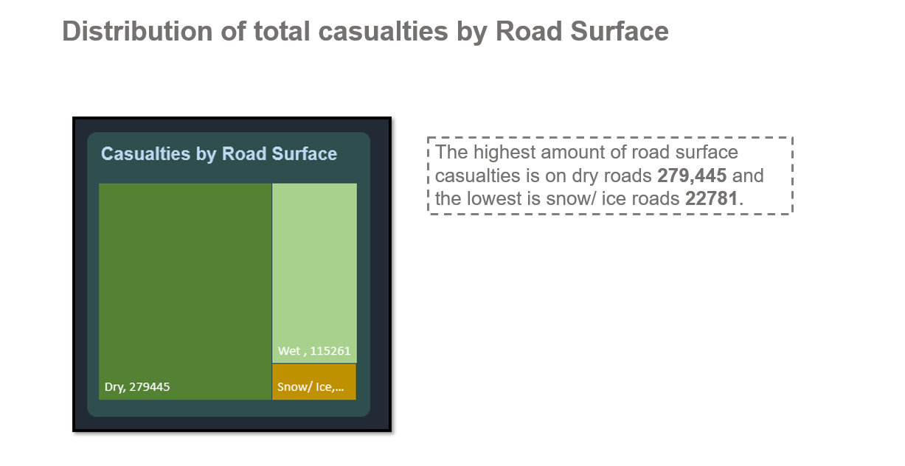
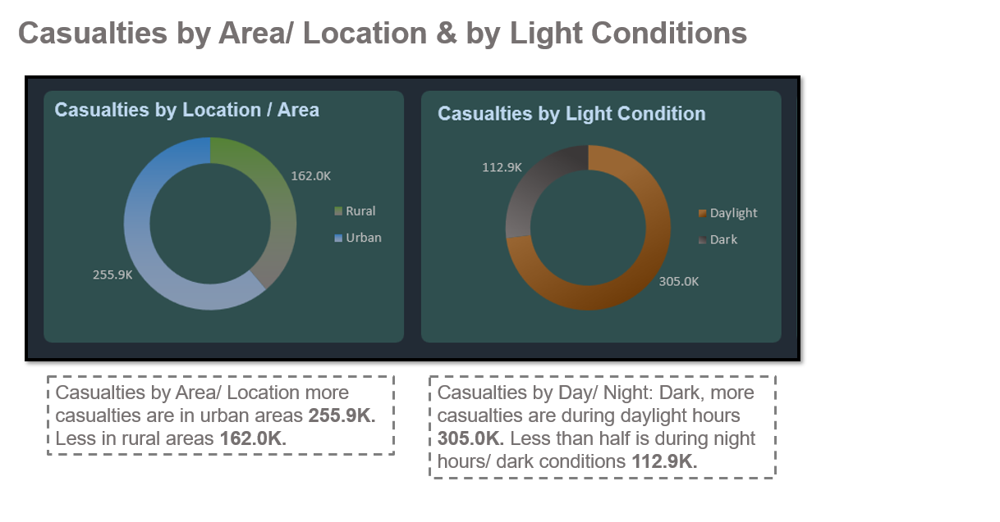

# Road_Accidents
## Road Accidents

### Requirements 
 Clients wants to produce a Road Accident Dashboard for year 2021 and 2022 so that they can have insight on the below requirements:

 Primary KPI: Total casualties taken after the accident. 
 Primary KPI’s: Total casualties & percentage of total by accident severity and maximum casualties by type of vehicle. 
 Secondary KPI’s: Total Casualties by Vehicle Type. 
<li>Monthly trend showing comparison of casualties for Current Year and Previous Year. 
<li>Maximum casualties by Road Type. 
<li>Distribution of total casualties by Road Surface. 
<li>Relation between Casualties by Area/ Location & by Day light/ Night: Dark conditions. 
  

Road Accidents Interactive dashboard where you can filter segments e.g., Accident Date (Years, Quarters, Months, Days) and (Rural/ Urban). On the left side is the navigation panel the four buttons under the blue logo. The first button brings you back to the dashboard from the data analysis sheet. The second button takes you to the data analysis sheet. The next button allows you to send an email from outlook of this dashboard and the last button sends you to the Reported Road Casualties Great Britain web page on Wikipedia.

Software Used: Microsoft Excel
  
Charts Used: Doughnut Chart x6, Image Icon chart, Line Chart, Bar Chart, Tree Map Chart and Filter Panel.

## Summary 

### Improvements:

Most road accidents are slight casualties 351,436. To prevent as much as possible any type of casualty on the road. The use of more and better-timed road safety advertisements on TV- before morning rush hour. Online YouTube adverts – morning, just before afternoon rush hour and in the evenings on the weekend. Huge electronic billboards placed near behind traffic lights on major high-speed roads and junctions. In both years of 2021 & 2022 the highest 2 months of casualties are October 20,109 (year 2021) | 18,287 (year 2022) and November 20,975 (year 2021) | 18,439 (year 2022). During these months it’s autumn there is a lot of rainfall, leaflets should be sent to all households that own a vehicle to be helpful reminders on how to safely drive in all conditions. Dry conditions which had the largest number of casualties when it comes to this type of road surface. 

Car drivers in particular thinking because the surface is dry and its daytime there might be less danger when driving, but there is more e.g., there are more drivers on the road and people are outside. This will bring more distractions on the road all kinds of advertisements should show this e.g., watch carefully all your mirrors in your car for drivers that are driving faster than the speed limit, don’t get too close to them and remind drivers to not drive when tired your concentration levels are low. In urban areas drivers must allow enough time to travel don’t leave last minute, rushing to get to your destination: work, school, concerts etc at a certain time.    

